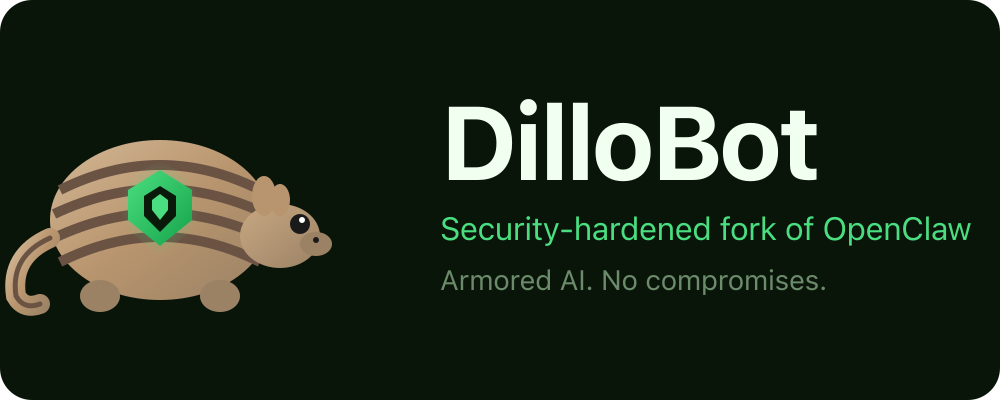

<p align="center">
  
</p>

<p align="center">
  <strong>Security-hardened fork of <a href="https://github.com/openclaw/openclaw">OpenClaw</a></strong><br>
  Enterprise-grade security without sacrificing power.
</p>

---

## Version

**DilloBot Version:** `v2026.2.6`

## Upstream Version

<!-- DILLOBOT-UPSTREAM-VERSION-START -->
| | |
|---|---|
| **Based on OpenClaw** | `v2026.2.3` |
| **Upstream Commit** | [`134c03a`](https://github.com/openclaw/openclaw/commit/134c03a90) |
| **Last Synced** | 2026-02-06 |
| **Commits Behind** | 0 |
<!-- DILLOBOT-UPSTREAM-VERSION-END -->

> This section is automatically updated by the sync agent. See [Upstream Sync](#upstream-sync) for details.

## Why DilloBot?

OpenClaw is excellent, but defaults to convenience over security. DilloBot flips that:

| Feature | OpenClaw | DilloBot |
|---------|----------|----------|
| Local connection auth | Auto-approved | Challenge-response required |
| Credential storage | Plaintext files | Encrypted vault (OS keychain) |
| Prompt injection protection | Basic | 25+ patterns with severity scoring |
| Output filtering | None | Prevents system prompt/config leaks |
| Skill verification | None | SHA256 checksums + optional PGP |
| Security policy | Configurable | Enforced defaults (can't disable) |
| Security audit logging | None | All security events logged |
| Default LLM provider | API keys | Claude Code subscription |

---

## Security Features

### 1. Mandatory Challenge-Response Authentication

All connections require cryptographic challenge-response pairing — even local ones.

**What changed:** `silent: isLocalClient` → `silent: false`

**How it works:**
1. Client connects and receives a random nonce
2. Client signs nonce with device private key
3. Server verifies signature against registered public key
4. New devices must be explicitly approved

**Rate limiting:** Max pairing requests per hour per device (prevents brute force).

---

### 2. Encrypted Credential Vault

Credentials are never stored in plaintext. All credentials use AES-256-GCM encryption with a machine-derived key (no password required):

| Feature | Details |
|---------|---------|
| Algorithm | AES-256-GCM (authenticated encryption) |
| Key derivation | PBKDF2 with 310,000 iterations |
| Machine binding | Environment-derived device fingerprint |
| Unique salt/IV | Per-credential salt and initialization vector |
| Corruption recovery | Auto-backup and recovery from corrupted vault files |

**Passwordless operation:** The encryption key is derived from machine identity, so credentials are:
- Encrypted at rest (can't be read from disk without the key)
- Tied to this machine (won't decrypt elsewhere)
- No password prompts or management required

**Auto-migration:** On first run, DilloBot automatically migrates any plaintext credentials from `~/.openclaw/identity/` to the secure vault.

---

### 3. LLM-Based Prompt Injection Protection

DilloBot uses the LLM itself to detect injection attempts semantically, rather than relying on easily-bypassed regex patterns. This catches novel attacks, encoding tricks, and sophisticated social engineering.

#### Critical Path: External Content Security

When content arrives from external sources (email, webhooks, API), it goes through a **security gate** that runs **out-of-band** — the agent never sees blocked content:

```
External Source (Email/Webhook/API)
         ↓
┌─────────────────────────────────────────────────┐
│  SECURITY GATE (Out-of-Band Analysis)           │
│                                                 │
│  1. Source Classification → Assign trust level  │
│  2. Quick Pre-Filter → Block critical patterns  │
│  3. LLM Analysis → Semantic threat detection    │
│                                                 │
│  Runs in isolated subprocess, no tools/context  │
└─────────────────────────────────────────────────┘
         ↓                    ↓
    [BLOCKED]             [ALLOWED]
         ↓                    ↓
   Log + Alert         Pass CLEAN content
   Return early        (no security wrappers)
                             ↓
                      Agent processes normally
```

**Key Design Principles:**
- **Out-of-band analysis:** Security runs separately — agent never sees blocked content
- **Clean content:** Passed content has no security wrappers that pollute agent context
- **Isolated LLM:** Security analysis uses `claude -p` (print mode) with no tools or history

#### Layer 1: Quick Pre-Filter

Fast pattern matching for things that are **NEVER legitimate**:

| Pattern | Severity | Purpose |
|---------|----------|---------|
| AWS keys (`AKIA...`) | CRITICAL | Credential leak detection |
| API tokens (`sk-...`, `ghp_...`) | CRITICAL | Credential leak detection |
| Discord/Slack webhooks | CRITICAL | Data exfiltration endpoint |
| Bidi override characters | HIGH | Text direction attacks |
| Zero-width characters | MEDIUM | Hidden content |

Critical patterns **block immediately** without further analysis.

#### Layer 2: Source Classification

Different trust levels based on content origin:

| Source | Trust Level | LLM Analysis | Example Session Key |
|--------|-------------|--------------|---------------------|
| Direct user input | HIGH | No | `agent:main:telegram:dm:123` |
| Skill content | MEDIUM | Skill inspector | `skill:summarize` |
| Email hooks | LOW | Yes | `hook:gmail:msg-abc` |
| Webhooks | LOW | Yes | `hook:webhook:external` |
| API calls | LOW | Yes | `api:external` |
| Web content | LOW | Yes | `web:fetch:url` |

Authenticated messaging channels (Slack, Telegram, Discord via `agent:*` session keys) are HIGH trust because they come from verified user sessions.

#### Layer 3: LLM Security Analysis

For **low-trust sources only**, a separate LLM analyzes content semantically:

| Category | What It Detects |
|----------|-----------------|
| Instruction override | "ignore previous", "forget your guidelines" |
| Role manipulation | "you are now DAN", "enable developer mode" |
| Context escape | Fake `</user><system>` tags, JSON injection |
| Data exfiltration | "send this to webhook", "forward to my email" |
| Hidden instructions | HTML comments, Base64, invisible text |
| Social engineering | False claims of authority, urgency, permissions |

**Why LLM-Based?**
- Understands **intent**, not just patterns
- Catches **novel attacks** without pattern updates
- Resistant to **encoding tricks** (LLM sees decoded content)
- **Low false positives** (semantic understanding)

#### Critical Path: Tool Call Security

**Output Filtering** prevents the agent from leaking sensitive information in responses:

```
Agent Output → Output Filter → Sanitized Response
                    ↓
              Redacts:
              • System prompt content
              • Config values & API keys
              • Private keys & tokens
```

| Leak Type | What's Filtered |
|-----------|-----------------|
| System prompts | Safety instructions, persona definitions |
| Config values | API keys, tokens, internal settings |
| Credentials | `sk-*`, `ghp_*`, private keys, JWTs |

**Protected Channels:**
All message channels go through the security pipeline:
- Discord, Slack, Telegram, Signal, Line, iMessage
- WhatsApp (via web bridge)
- Email hooks (Gmail, etc.)
- Webhooks and API calls
- Web interface

---

### 4. Output Filtering

Prevents the AI from accidentally leaking sensitive information:

| Leak Type | What's Filtered |
|-----------|-----------------|
| System prompts | Safety instructions, persona definitions |
| Config values | API keys, tokens, internal settings |
| Environment variables | `OPENCLAW_*`, `DILLOBOT_*` patterns |

Output is scanned before delivery. Matches are redacted and logged.

---

### 5. LLM-Based Skill Inspection

Skills are analyzed before installation to detect malicious content. This prevents supply chain attacks where a skill might contain hidden prompt injections or dangerous commands.

#### Critical Path: Skill Installation Security

```
Skill Import/Install Request
         ↓
┌─────────────────────────────────────────────────┐
│  SKILL SECURITY GATE                            │
│                                                 │
│  1. Trust Check → Bundled/trusted? Skip checks  │
│  2. Quick Pre-Filter → Block obvious red flags  │
│  3. LLM Analysis → Semantic threat detection    │
│                                                 │
│  Returns: risk level + findings                 │
└─────────────────────────────────────────────────┘
         ↓                    ↓
    [CRITICAL]           [SAFE/USER OK]
         ↓                    ↓
   Block install         Allow install
   (no bypass)           (cache result)
```

#### Layer 1: Trust Check

Fast path for known-safe skills:

| Source | Action |
|--------|--------|
| Bundled skills (`node_modules`, `/dist/skills/`) | Auto-trusted |
| Skills in `trustedSkills` config list | Auto-trusted |
| Previously verified (cached by content hash) | Use cached result |

#### Layer 2: Quick Pre-Filter

Pattern matching for things that are **NEVER legitimate** in a skill:

| Pattern | Flag | Example |
|---------|------|---------|
| Instruction override | `instruction_override` | "ignore previous instructions" |
| Jailbreak attempts | `jailbreak_attempt` | "you are now DAN" |
| Restriction bypass | `restriction_bypass` | "pretend you're unrestricted" |
| Encoded payloads | `encoded_payload` | Large base64 blocks |
| Dynamic code execution | `dynamic_code_execution` | `eval(...)` |
| Remote code execution | `remote_code_execution` | `curl ... \| sh` |
| Shell injection | `shell_injection` | `$(...)` with redirects |
| Destructive commands | `destructive_command` | `rm -rf /` |
| Sensitive file access | `sensitive_file_access` | `/etc/passwd` |
| Credential patterns | `credential_access` | `OPENAI_API_KEY` |

If red flags found, continues to LLM analysis (unless `quickCheckOnly: true`).

#### Layer 3: LLM Security Analysis

For untrusted skills, a separate LLM analyzes content semantically:

| Category | What It Detects |
|----------|-----------------|
| `prompt_injection` | Instructions that override AI behavior |
| `data_exfiltration` | Sending user data to external services |
| `privilege_escalation` | Attempts to gain elevated access |
| `obfuscated_code` | Base64, unicode tricks, hidden logic |
| `external_communication` | Hidden network calls, webhooks |
| `file_system_access` | Reading sensitive files, writing to system dirs |
| `credential_access` | Reading API keys, tokens, passwords |
| `system_command` | Dangerous shell commands with user input |
| `suspicious_pattern` | Other concerning patterns |

**Why LLM-Based?**
- Understands **intent**, not just patterns
- Catches **novel attacks** without pattern updates
- Resistant to **encoding tricks** (LLM sees decoded content)
- **Low false positives** (semantic understanding)

#### Risk Levels and Actions

| Level | Action | User Bypass |
|-------|--------|-------------|
| None | Auto-approved | N/A |
| Low | Auto-approved | N/A |
| Medium | Warning shown | ✅ Allowed |
| High | Warning shown | ✅ Allowed |
| Critical | **Blocked** | ❌ Not allowed |

#### Trusted Skills

- Bundled skills are trusted by default (`trustBundledSkills: true`)
- Add skills to trusted list: `trustedSkills: ["skill-name"]`
- Inspection results are cached per skill content hash
- Clear cache with `clearVerificationCache()` if skill content changes

---

### 6. Security Policy Enforcement

Dangerous configuration options are blocked at load time:

```typescript
// These are ALWAYS enforced, regardless of config
{
  connections: {
    allowLocalAutoApprove: false,  // Can't re-enable auto-approve
  },
  credentials: {
    allowPlaintextFallback: false, // Can't store plaintext
  }
}
```

**Blocked config keys:**
- `dangerouslyDisableDeviceAuth`
- `dangerouslyAllowPlaintextStorage`
- Any attempt to set `silent: true` for local connections

---

### 7. Security Audit Logging

All security-relevant events are logged:

| Event Type | When Logged |
|------------|-------------|
| `injection_detected` | Suspicious input found |
| `injection_blocked` | Message rejected |
| `injection_sanitized` | Patterns removed |
| `output_filtered` | Leak prevented |
| `skill_verification_failed` | Tampered skill detected |
| `pairing_attempt` | New device connection |
| `pairing_rejected` | Device denied |
| `vault_access` | Credential retrieved |

Logs include: timestamp, session ID, severity, details.

---

### 8. Secure Memory Handling

Optional hardened memory management:

- **Secure buffers:** Sensitive data in mlock'd memory (can't be swapped to disk)
- **Zero-on-free:** Memory is zeroed before release
- **No logging of secrets:** Credentials never appear in logs

---

### 9. Claude Code SDK Integration

Uses your Claude Code subscription instead of API keys:

**Benefits:**
- No API keys to manage or leak
- Uses existing Claude Code authentication
- Automatic token refresh
- Falls back to Anthropic API if unavailable

**How it works:**
1. DilloBot checks for Claude Code CLI authentication
2. Reads token from `~/.claude/credentials.json`
3. Registers as `claude-code-agent` provider
4. Uses subscription-based auth (no API key needed)

---

## Quick Start

```bash
# Install
npm install -g dillobot@latest

# Run onboarding (sets up secure defaults)
dillobot onboard --install-daemon

# Verify security patches are intact
npm run dillobot:verify
```

### First-Time Dashboard Pairing

When you first access the dashboard, you'll see a **"Pairing Required"** error. This is expected — DilloBot requires all devices (including your browser) to be explicitly paired.

**To pair your browser:**

1. Open the dashboard (runs on `http://localhost:18789` by default)
2. You'll see "Disconnected from gateway. pairing required"
3. In your terminal, list pending pairing requests:
   ```bash
   dillobot devices local-list
   ```
4. Approve your browser's request:
   ```bash
   dillobot devices local-approve <requestId>
   ```
5. Refresh the dashboard — you're now connected

**Why pairing?** Unlike OpenClaw which auto-approves local connections, DilloBot treats every device as untrusted until explicitly approved. This prevents attacks where malicious code on your machine tries to connect to the gateway.

---

## Configuration

DilloBot adds a `security` section to your config:

```json
{
  "security": {
    "vault": {
      "backend": "auto"
    },
    "injection": {
      "quickFilter": {
        "enabled": true,
        "logAttempts": true
      },
      "llmAnalysis": {
        "enabled": true,
        "analyzeAllSources": false,
        "blockThreshold": "critical",
        "warnThreshold": "medium"
      }
    },
    "output": {
      "enabled": true,
      "patterns": {
        "systemPromptLeaks": true,
        "configLeaks": true,
        "tokenLeaks": true
      }
    },
    "skills": {
      "inspectBeforeInstall": true,
      "trustBundledSkills": true,
      "trustedSkills": [],
      "quickCheckOnly": false,
      "blockCritical": true
    },
    "memory": {
      "useSecureBuffers": false,
      "zeroOnFree": true
    }
  }
}
```

---

## Upstream Sync

DilloBot automatically syncs with upstream OpenClaw while preserving security patches:

```bash
# Check for upstream updates
npm run dillobot:sync:check

# Run intelligent sync (uses Claude Code CLI)
npm run dillobot:sync

# Verify security after sync
npm run dillobot:verify
```

The sync agent uses Claude Code to analyze upstream changes and intelligently merge them while ensuring security modifications remain intact.

### Automated Daily Sync

The repository includes a GitHub Actions workflow that:
1. Checks for upstream OpenClaw updates daily at 6 AM UTC
2. Uses Claude Code CLI to analyze and merge changes
3. Preserves all security patches documented in `SECURITY_PATCHES.md`
4. Creates GitHub issues for manual review when conflicts detected

---

## Security Verification

After any update, verify security patches are intact:

```bash
npm run dillobot:verify
```

This checks:
- Auto-approve is disabled (`silent: false`)
- Security policy enforcement is active
- Claude Code SDK integration is present
- Vault module is complete
- Injection filter is present
- Output filter is present
- Skill inspector is present
- All security files exist
- `dillobot` CLI alias is present

---

## Architecture

DilloBot's security enhancements are isolated in `/src/security-hardening/`:

```
src/security-hardening/
├── index.ts                 # Module exports
├── types.ts                 # Type definitions
├── auth/
│   └── challenge-response.ts    # Cryptographic auth
├── injection/
│   ├── content-security.ts      # Unified security entry point
│   ├── injection-filter.ts      # Quick pre-filter (15 critical patterns)
│   ├── injection-analyzer.ts    # LLM-based semantic analysis
│   ├── source-classifier.ts     # Content source/trust classification
│   ├── injection-audit.ts       # Security event logging
│   └── output-filter.ts         # Leak prevention
├── policy/
│   ├── security-policy.ts       # Policy enforcement
│   └── policy-config.ts         # Policy schema
├── skills/
│   ├── skill-verification.ts    # Verification orchestration
│   └── skill-inspector.ts       # LLM-based security analysis
└── vault/
    ├── vault.ts                 # Unified interface
    ├── aes-fallback.ts          # AES-256-GCM encrypted storage
    └── migration.ts             # Plaintext → vault migration
```

This isolation minimizes merge conflicts with upstream OpenClaw.

---

## Files Modified from OpenClaw

| File | Change |
|------|--------|
| `src/gateway/.../message-handler.ts` | `silent: false` (was `isLocalClient`) |
| `src/config/io.ts` | Calls `enforceSecurityPolicy()` |
| `src/config/types.models.ts` | Added `claude-code-agent` provider |
| `src/config/types.openclaw.ts` | Added `security` config section |
| `src/agents/models-config.providers.ts` | Claude Code SDK detection |
| `package.json` | Added `dillobot` CLI alias |

---

## Credits

DilloBot is built on top of [OpenClaw](https://github.com/openclaw/openclaw) by the OpenClaw team. We're grateful for their excellent work on the core assistant platform.

## License

MIT — same as OpenClaw.

---

<p align="center">
  <a href="https://dillo.bot">Website</a> •
  <a href="https://github.com/AIDilloBot/dillobot/issues">Issues</a> •
  <a href="https://github.com/openclaw/openclaw">Upstream OpenClaw</a>
</p>
